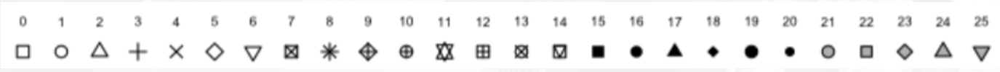
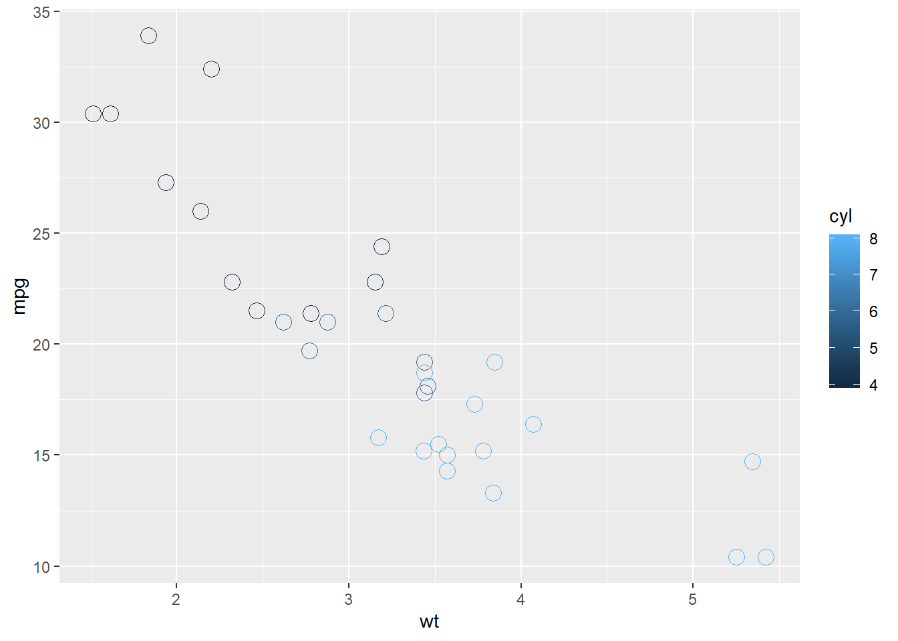
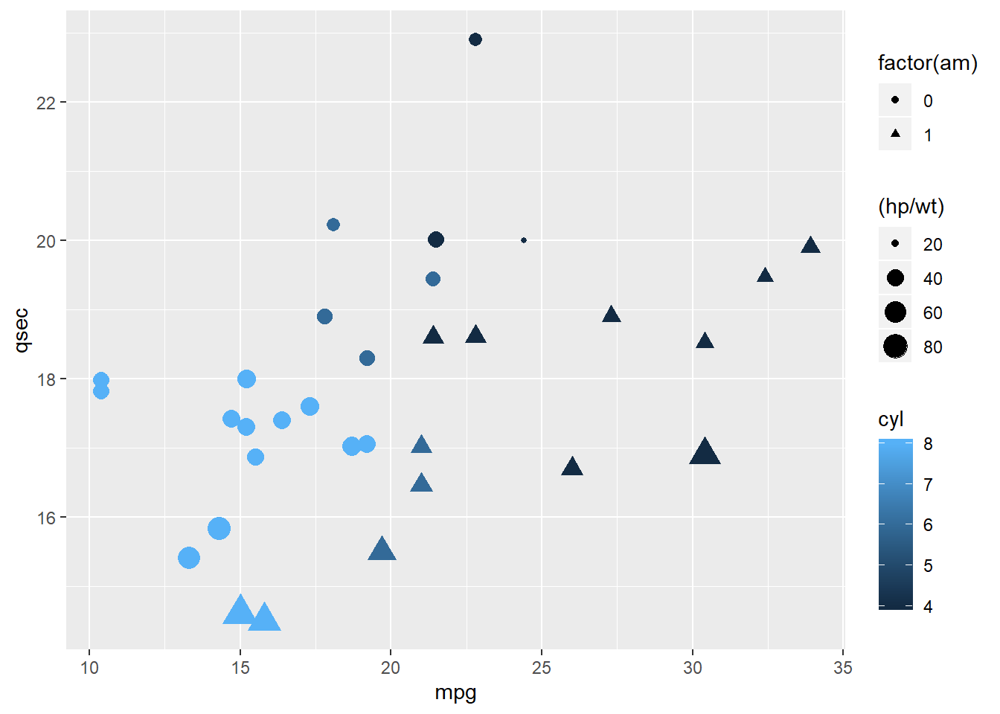
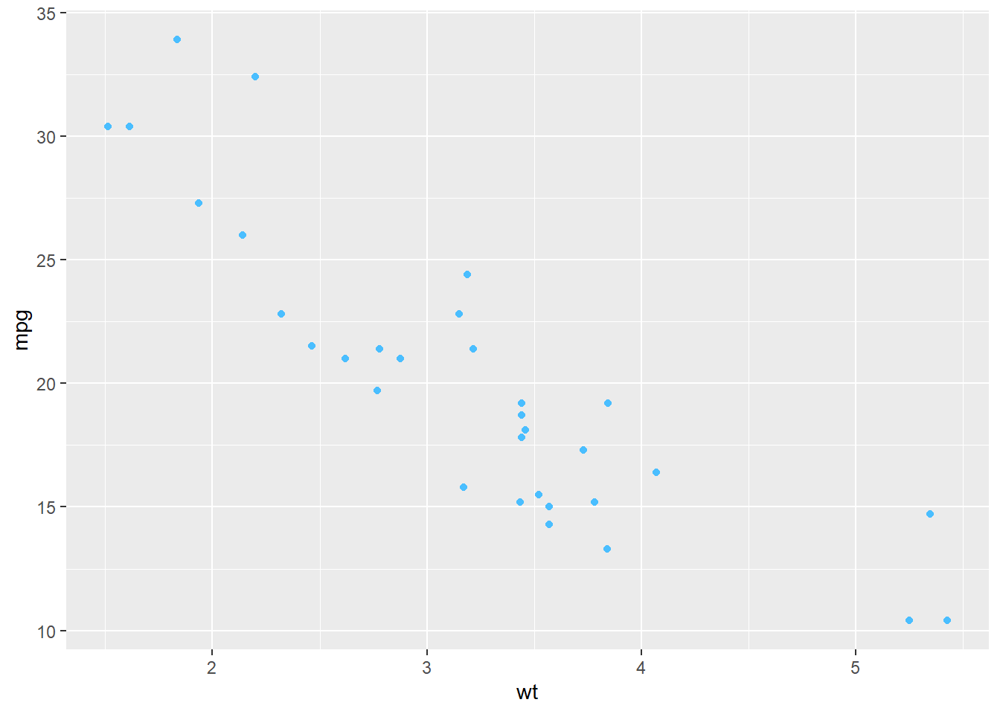
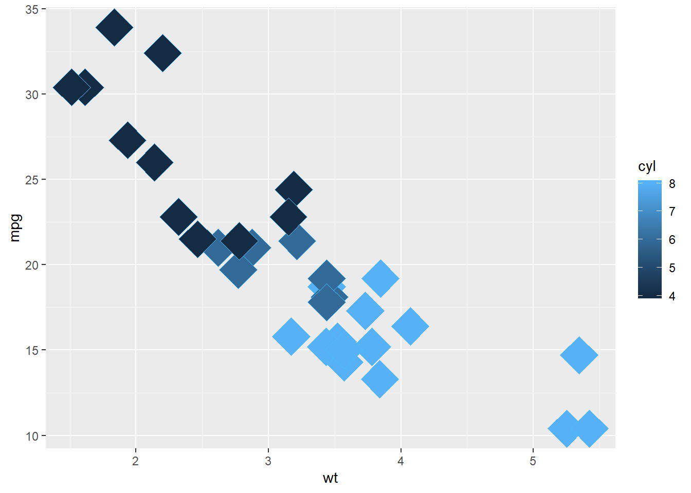
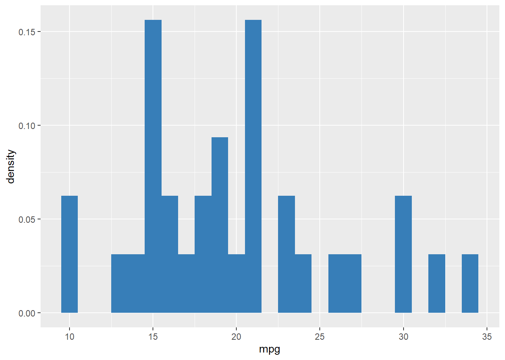
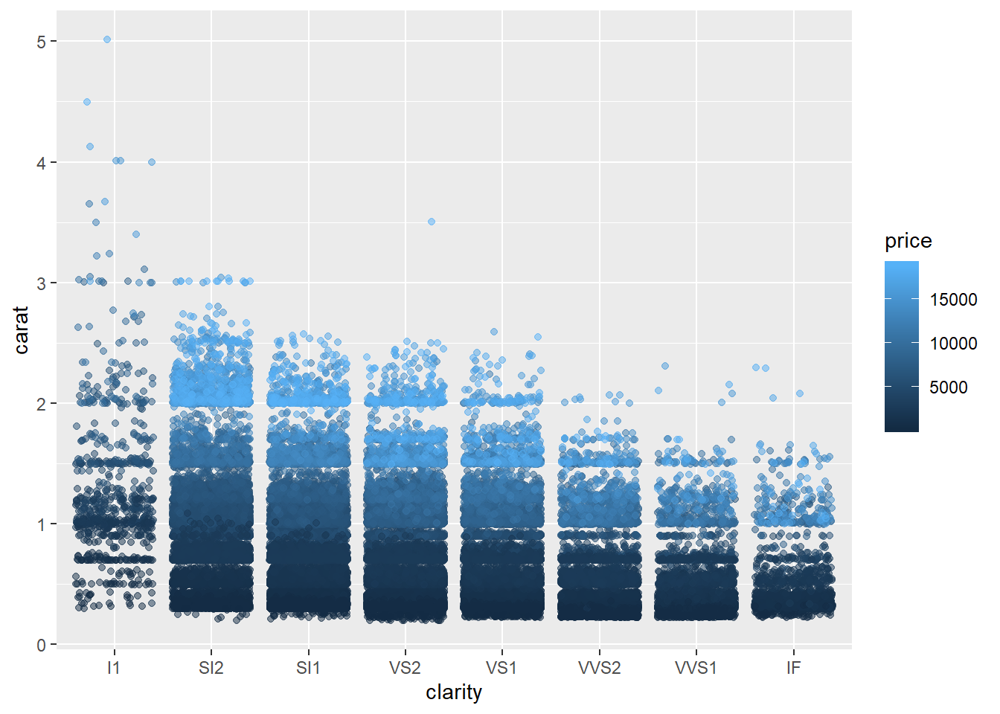
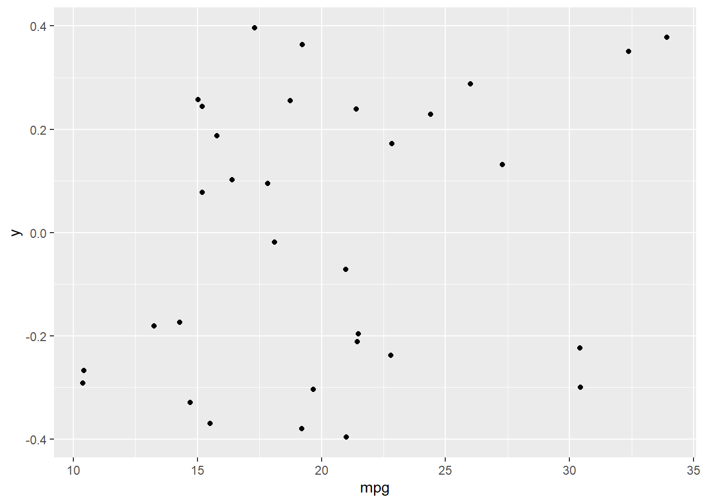
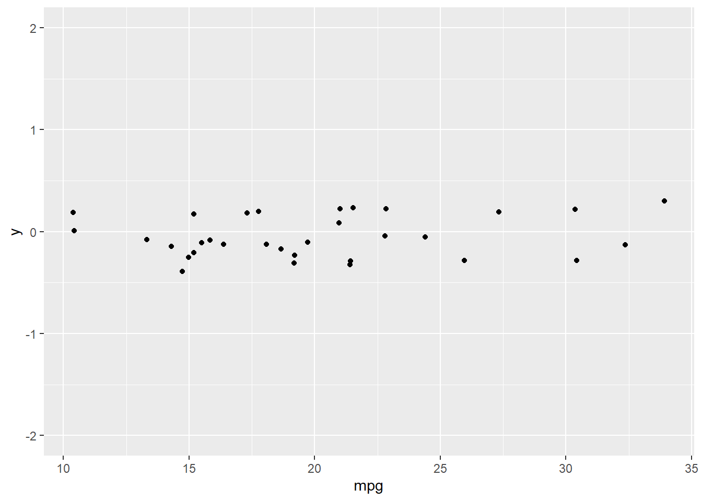

# ggplot2学习笔记1


 R 可视化学习笔记
 
记参数挺费劲的，还是用的时候查官方文档吧，现在记个大概就行吧~


## ggplot2分层次绘图

- 把绘图与数据分离，把数据相关的绘图与数据无关的绘图分离，按图层作图。ggplot2可以把绘图拆分成多个图层，且能够按照顺序创建多重图形
- 使用ggplot2包创建图形时，每个图形都是由函数ggplot()创建的，提供绘图的数据和映射
  - 数据（data）：数据框对象
  - 映射（mapping）：由aes()函数来设置映射

## ggplot2绘图组件

列几种常见的部件其余可以参考官方文档

- 几何对象(geom)
- 统计变换(stats)
- 标度(scale)
- 坐标系(coord)
- 分面(facet)
- 主题(theme)


```r
knitr::include_graphics("./figs/01.png")
```


  这些组件之间是通过“+”， 以图层(layer)的方式来粘合构图的，可以这样理解ggplot2中的图层：每个图层可以代表一个图形组件， 这些图形组件以图层的方式叠加在一起构成一个绘图的整体，在每个图层中的图形组件又可以分别设定数据、映射或其他相关参数，因此组件之间又是具有相对独立性的。越后面的图层越高。
**例如**

## data 
数据和映射

```r
ggplot(data = NULL, mapping = aes())
```


- data： 用于指定要用到的数据源，必须使**数据框类型**

## aes()

用来设定图形属性的

- mapping：使用aes()函数指定每个变量的角色，除x和y之外的其他参数，例如，size、color、shape等，必须采用name=value的形式。

- 在ggplot中设置的映射是默认映射关系，其他图层中可以继承该映射关系，或修改映射关系。也就是说，ggplot设置是全局的，其他图层可以继承或者进行修改[参考案例](http://www.360doc.com/content/19/0329/14/52645714_825079033.shtml)

- aes()中常见属性包括
  - x和y：用于指定x轴和y轴的变量
  - color：映射点或线的颜色
  - fill：映射填充区域的颜色
  - linetype：映射图形的线形(1=实线、2=虚线、3=点、4=点破折号、5=长破折号、6=双破折号)
  - size：点的尺寸和线的宽度
  - shape：映射点的形状
  


```r

```


 
- group：默认情况下ggplot2把所有观测点分为了一组

  - 如果需要把观测点按指定的因子进行分组处理，必须修改默认的分组设置
    
  - 分组也可以通过映射把视觉特征（shape、color、fill、size和linetype等）设置为变量来实现分组，分组通常使用因子来实现，这就要求在数据集中存在因子变量，用于对数据分类，实现图形的分组
    
  - group设置col区分不同属性
      

```r
ggplot(mtcars, aes(wt, mpg,col=cyl)) +
  geom_point(shape=1, size=4)
```



**区分一下col和fill，一个是空心的，一个是实心的，fill是填充嘛**
举个栗子
## 设置fill区分不同的属性


```r
ggplot(mtcars, aes(x = wt, y = mpg, fill = cyl)) +
  geom_point(shape = 21, size = 4,alpha=0.6)
```


## factor
若变量是连续型的，则需要将变量离散化，因此factor出现了,否则报错Error: A continuous variable can not be mapped to shape

```r
ggplot(mtcars, aes(x = mpg, y = qsec, col = cyl, shape = factor(am), size = (hp/wt))) +
  geom_point()
```



```r
> diamonds
# A tibble: 1,000 x 10
   carat cut       color clarity depth table price     x     y     z
 * <dbl> <ord>     <ord> <ord>   <dbl> <dbl> <int> <dbl> <dbl> <dbl>
 1  0.31 Ideal     G     VS1      62.4    55   802  4.35  4.33  2.71
 2  1.5  Good      G     SI2      64.3    57  8190  7.29  7.2   4.66
 3  0.9  Premium   H     VS2      62.8    58  3810  6.17  6.13  3.86
 4  1.01 Ideal     F     VS2      60.9    58  7411  6.43  6.47  3.93
 5  0.33 Very Good D     VS1      63.2    56  1109  4.45  4.44  2.81
 6  1.08 Ideal     G     VS1      62      55  6779  6.62  6.57  4.09
 7  1.07 Premium   G     SI1      61.6    58  5453  6.6   6.56  4.05
 8  0.33 Premium   H     VS1      59.5    59   743  4.53  4.48  2.68
 9  0.44 Ideal     H     IF       62      57  1255  4.87  4.91  3.02
10  1    Premium   G     VS1      58.6    61  6989  6.57  6.5   3.83
# ... with 990 more rows
```


```r
# Create the object containing the data and aes layers: dia_plot
dia_plot <- ggplot(diamonds, aes(x = carat, y = price))

# Add the same geom layer, but with aes() inside
dia_plot + geom_point(aes(color = clarity))
```


**放一组对比代码**查看各个参数的作用

```r
# Map cyl to size
ggplot(mtcars, aes(x = wt, y = mpg, size = cyl)) +
  geom_point()
```


```r
# Map cyl to alpha
ggplot(mtcars, aes(x = wt, y = mpg, alpha = cyl)) +
  geom_point()
```


```r
# Map cyl to shape 
ggplot(mtcars, aes(x = wt, y = mpg, shape = factor(cyl))) +
  geom_point()
```


```r
# Map cyl to labels
ggplot(mtcars, aes(x = wt, y = mpg, label = cyl)) +
  geom_text()
```


## fill属性

直接使用fill属性设置填充，是无效的，若不在aes里面设置color，需要结合fill和子图层的color,直接在子图层设置color属性值，也是无效的，因此需要分组
**这里需要复习一下数据处理的的gather函数，由宽面板变为长面板**

```r
my_color <- "#4ABEFF"
ggplot(mtcars, aes(x = wt, y = mpg)) +
  geom_point(color = my_color)
```



```r
# Set the fill aesthetic; color, size and shape attributes
ggplot(mtcars, aes(x = wt, y = mpg, fill = cyl)) +
  geom_point(size = 10, shape = 23, color = my_color)
```



## geom_xxx
- 几何对象控制图层的渲染和生成的图像类型，例如，geom_point()会生成散点图，而geom_line会生成折线图。
  - 函数ggplot()可以设置图形，但是没有视觉输出，需要使用一个或多个几何函数向图形中添加几何对象（geometric，简写为geom），包括点（point）、线（line）、条（bar）等，而添加几何图形的格式十分简单，通过符号“+”把几何图形添加到plot中
```r
ggplot()+
geom_xxx()
```
[ggplot2官方文档geom_xxx](https://ggplot2.tidyverse.org/reference/)

- geom_text()添加文本
- geom_bar（）条形图
  - position
geom_bar()里面的位置调整参数
  -identity（默认）
  - jitter
  - stack 堆叠
  - fill 堆叠显示百分比
  - dodge 并列
  - posn_d overlab 叠加
- geom_points() 散点图==scatter

举个栗子
```r
cyl.am + 
geom_bar(position="stack")

# Fill - show proportion
cyl.am + 
  geom_bar(position = "fill")  

# Dodging - principles of similarity and proximity
cyl.am +
  geom_bar(position ="dodge") 

# Clean up the axes with scale_ functions
val = c("#E41A1C", "#377EB8")
lab = c("Manual", "Automatic")
cyl.am +
  geom_bar(position = "dodge") +
  scale_x_discrete("Cylinders") + 
  scale_y_continuous("Number") +
  scale_fill_manual("Transmission", 
                    values = val,
                    labels = lab)
```

```r
ggplot(mtcars, aes(x = cyl, fill = am)) +
  geom_bar(position = posn_d, alpha = 0.6)
```
- geom_histgram 柱状图

```r
ggplot(mtcars, aes(mpg)) +
  geom_histogram(aes(y = ..density..), binwidth = 1, fill = "#377EB8")
```


- geom_freqpoly 柱状图的曲线图


```r
ggplot(mtcars, aes(mpg, color = cyl)) +
  geom_freqpoly(binwidth = 1)
```


- lines
时间序列图
- geom_rect()
```r
ggplot(economics, aes(x = date, y = unemploy/pop)) +
  geom_rect(data = recess,
            aes(xmin = begin, xmax = end, ymin = -Inf, ymax = +Inf),
            inherit.aes = FALSE, fill = "red", alpha = 0.2) +
  geom_line()
```

**geom_xxx常见参数**

- color：对点、线和填充区域的边界进行着色
- fill：对填充区域着色
- alpha：演示的透明度，从透明（0）到不透明（1）
- linetype：图案的线条（1=实线、2=虚线、3=点、4=点破折号、5=长破折号、6=双破折号）
- size：点的尺寸和线的宽度
- shape：点的形状（和par()函数的pch参数相同）
- position：绘制条形图和点等对象的位置

举个栗子

```r
# Scatter plot: clarity (x), carat (y), price (color)
ggplot(diamonds, aes(x = clarity, y = carat, color = price)) +
  geom_point(alpha = 0.5)
```


```r
# Dot plot with jittering
ggplot(diamonds, aes(x = clarity, y = carat, color = price)) +
  geom_point(alpha = 0.5, position = "jitter")
```


**设置position之后，明显看清了，因该是调整了刻度**


- binwidth：分箱的宽度
- notch：表示方块图是否应该有缺口
- sides：地毯图的位置（"b"=底部、"l"=左部、"r"=右部、"bl"=左下部，等)
- width：箱线图的宽度
**label and shape are only applicable to categorical data.**


## geom_jitter()
在R中散点图的时候会经常出现，点重合比较严重的现象，这对我们寻找数据规律或者观察数据有很大的干扰。因此R中，可以用geom_jitter()函数来调整，消除点的重合。
```python
geom_jitter(mapping = NULL, data = NULL, stat = "identity", position = "jitter", ..., width = NULL, height = NULL, na.rm = FALSE, show.legend = NA, inherit.aes = TRUE)
```
就参数而言，geom_jitter()和其他函数差别不大，特别的两个参数是width,height

- width 用于调节点波动的宽度

- height 用于调节点波动的高度

例如有一个散点图


```r
knitr::include_graphics("./figs/07.png")
```


经过处理之后，明显不重合了

```r
ggplot(mtcars, aes(x = mpg, y = 0)) +
  geom_jitter()
```



```r
# 2 - Add function to change y axis limits
ggplot(mtcars, aes(x = mpg, y = 0)) +
  geom_jitter() +
  scale_y_continuous(limits = c(-2,2))#设置y轴起始刻度，这是连续变量刻度
```




## scale 
- 标度:标度控制着数据到图形属性的映射，更重要的一点是标度将我们的数据转化为视觉上可以感知的东西, 如大小、颜色、位置和形状。所以通过标度可以修改坐标轴和图例的参数
[scale](https://ggplot2.tidyverse.org/reference/index.html#section-scales)

## 常见scale

- labs()标签 xlab() ylab() ggtitle()
- 图形选项（颜色、size、形状、线形等）

自定义图形选项

scale_colour_manual() 
scale_fill_manual() 
scale_size_manual() 
scale_shape_manual() 
scale_linetype_manual() 
scale_alpha_manual() 
scale_discrete_manual()
- 坐标轴 
标度是区分离散和连续变量的，标度用于将连续型、离散型和日期-时间型变量映射到绘图区域，以及构造对应的坐标轴

##  坐标轴
坐标系统确定x和y美学如何组合以在图中定位元素。默认的坐标系是笛卡尔坐标系，coord_cartesian()，笛卡尔坐标系是最常用的坐标系，函数coord_flip() 用于反转笛卡尔坐标系，把x轴和y轴对调，一般采用默认的额

## facet
~~**这个参数一开始我不太懂是用来做什么的**~~
```r
facet_grid(rows = NULL, cols = NULL, scales = "fixed",
  space = "fixed", shrink = TRUE, labeller = "label_value",
  as.table = TRUE, switch = NULL, drop = TRUE, margins = FALSE,
  facets = NULL)
```
- rows, cols	
A set of variables or expressions quoted by vars() and defining faceting groups on the rows or columns dimension. The variables can be named (the names are passed to labeller).
For compatibility with the classic interface, rows can also be a formula with the rows (of the tabular display) on the LHS and the columns (of the tabular display) on the RHS; the dot in the formula is used to indicate there should be no faceting on this dimension (either row or column).
数据框的行列，变量
- scales	
  - "fixed" x和y的标度在所用平面中都相同，在不同分面中进行固定
  - "free_x" 固定x轴，y轴自由变化
  - "free_y" 固定y轴，x轴自由变化
  - "free" x和y的标度在每个版面都可以变化

- space	
If "fixed", the default, all panels have the same size. If "free_y" their height will be proportional to the length of the y scale; if "free_x" their width will be proportional to the length of the x scale; or if "free" both height and width will vary. This setting has no effect unless the appropriate scales also vary.

- 可以根据数据的不同分组, 将图形按照水平或者垂直方向进行分割，同时可以共享x轴或者y轴
- 分组和刻面都用于对数据分组，便于观察各自的规律、趋势和模式，不同的是，分组是把图形绘制到一个大的图形中，通过美学特征来区分，而刻面是把图形绘制到不同的网格中。
- 刻面是在一个画布上分布多幅图形，这一过程需要先把数据划分为多个子集， 然后把每个子集依次绘制到画布的不同面板中
  - facet_grid()在网格分面
    - 根据数据不同可以绘制共用x轴或者y轴的子图，python中的subplots，

```r
str(iris.tidy)

# Think about which dataset you would use to get the plot shown right
# Fill in the ___ to produce the plot given to the right
ggplot(iris.tidy, aes(x = Species, y = Value, col = Part)) +
  geom_jitter() +
  facet_grid(. ~ Measure)

 str(iris.tidy)
'data.frame':	600 obs. of  4 variables:
 $ Species: Factor w/ 3 levels "setosa","versicolor",..: 1 1 1 1 1 1 1 1 1 1 ...
 $ Part   : chr  "Sepal" "Sepal" "Sepal" "Sepal" ...
 $ Measure: chr  "Length" "Length" "Length" "Length" ...
 $ Value  : num  5.1 4.9 4.7 4.6 5 5.4 4.6 5 4.4 4.9 ...
```


  - facet_wrap()将一维面板的丝带缠绕成二维，封装分面，自动分成2x4, 3x2等版块
  - vars()引用分面变量
[具体可以参考](https://blog.csdn.net/weixin_43528109/article/details/83859327)
## theme

主题

## 为何使用ggplot
因为省代码:smile:hahah~
来一个栗子对比一下
- 基础包里面的plot绘图

```r
# Convert cyl to factor (don't need to change)
mtcars$cyl <- as.factor(mtcars$cyl)

# Example from base R (don't need to change)
plot(mtcars$wt, mtcars$mpg, col = mtcars$cyl)
abline(lm(mpg ~ wt, data = mtcars), lty = 2)
lapply(mtcars$cyl, function(x) {
  abline(lm(mpg ~ wt, mtcars, subset = (cyl == x)), col = x)
  })
```

```
## [[1]]
## NULL
## 
## [[2]]
## NULL
## 
## [[3]]
## NULL
## 
## [[4]]
## NULL
## 
## [[5]]
## NULL
## 
## [[6]]
## NULL
## 
## [[7]]
## NULL
## 
## [[8]]
## NULL
## 
## [[9]]
## NULL
## 
## [[10]]
## NULL
## 
## [[11]]
## NULL
## 
## [[12]]
## NULL
## 
## [[13]]
## NULL
## 
## [[14]]
## NULL
## 
## [[15]]
## NULL
## 
## [[16]]
## NULL
## 
## [[17]]
## NULL
## 
## [[18]]
## NULL
## 
## [[19]]
## NULL
## 
## [[20]]
## NULL
## 
## [[21]]
## NULL
## 
## [[22]]
## NULL
## 
## [[23]]
## NULL
## 
## [[24]]
## NULL
## 
## [[25]]
## NULL
## 
## [[26]]
## NULL
## 
## [[27]]
## NULL
## 
## [[28]]
## NULL
## 
## [[29]]
## NULL
## 
## [[30]]
## NULL
## 
## [[31]]
## NULL
## 
## [[32]]
## NULL
```

```r
legend(x = 5, y = 33, legend = levels(mtcars$cyl),
       col = 1:3, pch = 1, bty = "n")
```


ggplot绘图

```r
ggplot(mtcars, aes(x = wt, y = mpg, col = cyl)) +
  geom_point() +
  geom_smooth(method = "lm", se = FALSE) +
  geom_smooth(aes(group = 1), method = "lm", se = FALSE, linetype = 2)
```


## wide函数，将宽面板，变成长面板

```r
# Load the tidyr package
library(tidyr)

# Add column with unique ids (don't need to change)
iris$Flower <- 1:nrow(iris)

# Fill in the ___ to produce to the correct iris.wide dataset
iris.wide <- iris %>%
  gather(key, value, -Species, -Flower) %>%
  separate(key, c("Part","Measure"), "\\.") %>%
  spread(Measure, value)
```

## qplot

快速作图，类似与plot
