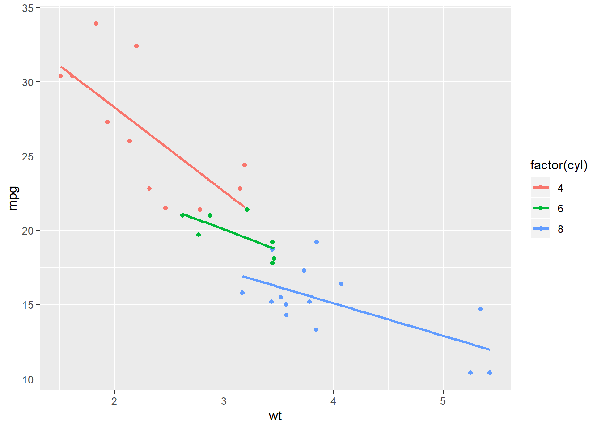

# ggplot学习笔记2

## stats
增加
统计变换

stat_xxx

```r
knitr::include_graphics('./figs/08.png')
```


这个我还是不知道有啥区别

- 统计变换是对数据进行统计，通常以某种方式对数据信息进行汇总,例如通过stat_smooth()添加光滑曲线。

- 每一个几何对象都有一个默认的统计变换,并且每一个统计变换都有一个默认的几何对象

## stat_smooth

- 对原始数据进行某种统计变换计算，然后在图上表示出来，例如对散点图上加一条**回归线**。
- 添加默认曲线
- method 表示指定平滑曲线的统计函数，如lm线性回归, glm广义线性回归, loess多项式回归, gam广义相加模型(mgcv包), rlm稳健回归(MASS包)

  - formula 表示指定平滑曲线的方程，如 y~x, y~poly(x, 2), y~log(2) ，需要与method参数搭配使用
  - se 表示是否显示平滑曲线的置信区间，默认TRUE显示；level = 0.95
  

```r
library(ggplot2)
# Explore the mtcars data frame with str()
str(mtcars)
```

```
## 'data.frame':	32 obs. of  11 variables:
##  $ mpg : num  21 21 22.8 21.4 18.7 18.1 14.3 24.4 22.8 19.2 ...
##  $ cyl : num  6 6 4 6 8 6 8 4 4 6 ...
##  $ disp: num  160 160 108 258 360 ...
##  $ hp  : num  110 110 93 110 175 105 245 62 95 123 ...
##  $ drat: num  3.9 3.9 3.85 3.08 3.15 2.76 3.21 3.69 3.92 3.92 ...
##  $ wt  : num  2.62 2.88 2.32 3.21 3.44 ...
##  $ qsec: num  16.5 17 18.6 19.4 17 ...
##  $ vs  : num  0 0 1 1 0 1 0 1 1 1 ...
##  $ am  : num  1 1 1 0 0 0 0 0 0 0 ...
##  $ gear: num  4 4 4 3 3 3 3 4 4 4 ...
##  $ carb: num  4 4 1 1 2 1 4 2 2 4 ...
```

```r
# A scatter plot with LOESS smooth
ggplot(mtcars, aes(x = wt, y = mpg)) +
  geom_point()+
  geom_smooth()
```


```r
# A scatter plot with an ordinary Least Squares linear model
ggplot(mtcars, aes(x = wt, y = mpg)) +
  geom_point()+
  geom_smooth(method="lm")
```


```r
# The previous plot, without CI ribbon
ggplot(mtcars, aes(x = wt, y = mpg)) +
  geom_point()+
  geom_smooth(method="lm",se=FALSE)
```


```r
# The previous plot, without points
ggplot(mtcars, aes(x = wt, y = mpg)) +
  geom_smooth(method="lm",se=FALSE)
```


以下为ggplot2提供的其他统计变换方式，也可以自己写函数基于原始数据进行计算。[CNBLOG](https://www.cnblogs.com/Mao1518202/p/11345410.html)
```r

stat_abline       stat_contour      stat_identity     stat_summarystat_bin          stat_density      stat_qq           stat_summary2dstat_bin2d        stat_density2d    stat_quantile     stat_summary_hexstat_bindot       stat_ecdf         stat_smooth       stat_uniquestat_binhex       stat_function     stat_spoke        stat_vlinestat_boxplot      stat_hline        stat_sum          stat_ydensity
```

## group

https://www.cnblogs.com/nxld/p/6059603.html

```r
# 1 - Define cyl as a factor variable
ggplot(mtcars, aes(x = wt, y = mpg, col = factor(cyl))) +
  geom_point() +
  stat_smooth(method = "lm", se = FALSE)
```



```r
# 2 - Plot 1, plus another stat_smooth() containing a nested aes()
ggplot(mtcars, aes(x = wt, y = mpg, col = factor(cyl))) +
  geom_point() +
  stat_smooth(method = "lm", se = FALSE) +
  stat_smooth(method = "lm", se = FALSE, aes(group = 1))
```


